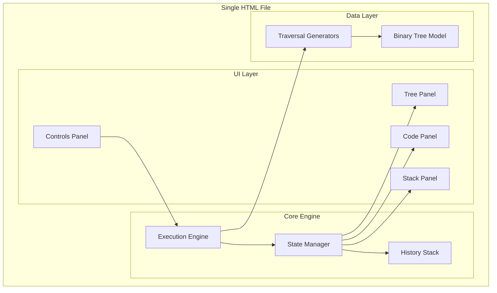

# Design Document: Interactive Tree Traversal Visualizer

## Overview

The Interactive Tree Traversal Visualizer is a single-page educational tool that demonstrates binary tree traversals (Inorder, Preorder, Postorder) by visualizing the internal workings of recursion. The application synchronizes three visual components: a tree diagram, a code panel with line highlighting, and a call stack visualizer that shows stack frames being pushed and popped.

The tool is implemented as a single HTML file using vanilla JavaScript, CSS3, and HTML5 Canvas/SVG for rendering, making it easy to study, modify, and run without any build process.

## Architecture



### High-Level Flow

1. User selects a traversal type and clicks Start/Next Step
2. Execution Engine generates execution steps using Traversal Generators
3. State Manager updates the current state and stores snapshots in History Stack
4. UI components (Tree, Code, Stack panels) render based on current state
5. Previous Step restores state from History Stack

## Components and Interfaces

### 1. Binary Tree Model

```javascript
/**
 * Represents a node in the binary tree
 */
interface TreeNode {
    value: number;
    left: TreeNode | null;
    right: TreeNode | null;
    x: number;  // Computed x position for rendering
    y: number;  // Computed y position for rendering
}

/**
 * Creates the default 7-node binary tree
 * Structure:
 *        4
 *       / \
 *      2   6
 *     / \ / \
 *    1  3 5  7
 */
function createDefaultTree(): TreeNode;

/**
 * Computes x,y positions for all nodes based on canvas dimensions
 */
function computeNodePositions(root: TreeNode, width: number, height: number): void;
```

### 2. Execution Step Model

```javascript
/**
 * Types of execution steps
 */
enum StepType {
    CALL,           // Entering a function (push stack frame)
    CHECK_NULL,     // Checking if node is null
    PROCESS_NODE,   // Processing/visiting the current node
    RECURSE_LEFT,   // About to recurse left
    RECURSE_RIGHT,  // About to recurse right
    RETURN          // Returning from function (pop stack frame)
}

/**
 * Represents a single execution step
 */
interface ExecutionStep {
    type: StepType;
    nodeValue: number | null;  // null for null node checks
    codeLine: number;          // 1-indexed line number to highlight
    stackAction: 'push' | 'pop' | 'none';
    nodeState: NodeState;      // State to set on the tree node
}

/**
 * Node visual states
 */
enum NodeState {
    UNVISITED = 'unvisited',
    PROCESSING = 'processing',
    VISITED = 'visited',
    FINISHED = 'finished'
}
```

### 3. State Manager

```javascript
/**
 * Complete application state at any moment
 */
interface AppState {
    currentStepIndex: number;
    callStack: StackFrame[];
    nodeStates: Map<number, NodeState>;  // nodeValue -> state
    highlightedLine: number;
    traversalType: 'inorder' | 'preorder' | 'postorder';
    isPlaying: boolean;
    animationSpeed: number;  // milliseconds per step
}

/**
 * A single stack frame
 */
interface StackFrame {
    functionName: string;
    nodeValue: number | null;
    returnAddress: string;  // e.g., "line 4" or "caller"
}

/**
 * State manager interface
 */
interface StateManager {
    getState(): AppState;
    setState(state: AppState): void;
    pushHistory(state: AppState): void;
    popHistory(): AppState | null;
    clearHistory(): void;
    subscribe(callback: (state: AppState) => void): void;
}
```

### 4. Traversal Generators

```javascript
/**
 * Generates all execution steps for a traversal
 * Returns an array of steps that can be stepped through
 */
interface TraversalGenerator {
    generateSteps(root: TreeNode): ExecutionStep[];
}

/**
 * Inorder: Left -> Root -> Right
 */
class InorderGenerator implements TraversalGenerator;

/**
 * Preorder: Root -> Left -> Right
 */
class PreorderGenerator implements TraversalGenerator;

/**
 * Postorder: Left -> Right -> Root
 */
class PostorderGenerator implements TraversalGenerator;
```

### 5. Execution Engine

```javascript
/**
 * Controls the execution flow
 */
interface ExecutionEngine {
    // Initialize with traversal type
    initialize(type: 'inorder' | 'preorder' | 'postorder'): void;
    
    // Step controls
    nextStep(): boolean;  // Returns false if at end
    previousStep(): boolean;  // Returns false if at start
    reset(): void;
    
    // Auto-play controls
    play(): void;
    pause(): void;
    setSpeed(ms: number): void;
    
    // State access
    isAtStart(): boolean;
    isAtEnd(): boolean;
    getCurrentStep(): ExecutionStep | null;
}
```

### 6. UI Renderers

```javascript
/**
 * Renders the binary tree with node states
 */
interface TreeRenderer {
    render(root: TreeNode, nodeStates: Map<number, NodeState>): void;
    highlightNode(value: number, state: NodeState): void;
}

/**
 * Renders the code panel with line highlighting
 */
interface CodeRenderer {
    setTraversalType(type: 'inorder' | 'preorder' | 'postorder'): void;
    highlightLine(lineNumber: number): void;
    clearHighlight(): void;
}

/**
 * Renders the call stack visualization
 */
interface StackRenderer {
    render(stack: StackFrame[]): void;
    animatePush(frame: StackFrame): Promise<void>;
    animatePop(): Promise<void>;
}
```

## Data Models

### Tree Structure

The default tree is a complete binary tree with 7 nodes:

```
        4
       / \
      2   6
     / \ / \
    1  3 5  7
```

Node positions are computed using a level-order layout algorithm where:
- Root is centered horizontally
- Each level doubles the horizontal spread
- Vertical spacing is fixed between levels

### Code Templates

Each traversal type has a corresponding Java code template:

**Inorder (6 lines):**
```java
void inOrder(Node node) {
    if (node == null) return;
    inOrder(node.left);
    print(node.val);
    inOrder(node.right);
}
```

**Preorder (6 lines):**
```java
void preOrder(Node node) {
    if (node == null) return;
    print(node.val);
    preOrder(node.left);
    preOrder(node.right);
}
```

**Postorder (6 lines):**
```java
void postOrder(Node node) {
    if (node == null) return;
    postOrder(node.left);
    postOrder(node.right);
    print(node.val);
}
```

### Execution Step Sequence Example (Inorder on node 2)

| Step | Type | Node | Line | Stack Action | Node State |
|------|------|------|------|--------------|------------|
| 1 | CALL | 2 | 1 | push | processing |
| 2 | CHECK_NULL | 2 | 2 | none | processing |
| 3 | RECURSE_LEFT | 2 | 3 | none | processing |
| 4 | CALL | 1 | 1 | push | processing |
| ... | ... | ... | ... | ... | ... |
| n | RETURN | 2 | 6 | pop | finished |


## Correctness Properties

*A property is a characteristic or behavior that should hold true across all valid executions of a system-essentially, a formal statement about what the system should do. Properties serve as the bridge between human-readable specifications and machine-verifiable correctness guarantees.*

### Property 1: Node State Color Mapping

*For any* tree node and *for any* valid node state (Unvisited, Processing, Visited, Finished), the rendered node color SHALL match the predefined color for that state.

**Validates: Requirements 1.2**

### Property 2: Node Rendering Completeness

*For any* tree with parent-child relationships, the renderer SHALL produce visual connections for every edge, and *for any* node, the rendered output SHALL contain that node's value.

**Validates: Requirements 1.3, 1.4**

### Property 3: Code Line Highlighting Accuracy

*For any* execution step with a codeLine property, the highlighted line in the code panel SHALL equal the step's codeLine value.

**Validates: Requirements 2.2**

### Property 4: Stack Push on Function Call

*For any* execution step of type CALL, executing that step SHALL increase the call stack size by exactly one, and the new top frame SHALL contain the called node's value.

**Validates: Requirements 3.1**

### Property 5: Stack Pop on Function Return

*For any* execution step of type RETURN, executing that step SHALL decrease the call stack size by exactly one.

**Validates: Requirements 3.2**

### Property 6: Stack Frame Contains Node Value

*For any* stack frame in the call stack, the rendered frame SHALL display the node value (or "null" for null checks) that was passed to that function call.

**Validates: Requirements 3.3**

### Property 7: Stack Visual Order is LIFO

*For any* call stack with multiple frames, the visual rendering SHALL display frames in LIFO order with the most recent call at the top.

**Validates: Requirements 3.4**

### Property 8: Next Step Advances by One

*For any* application state where the current step is not the last step, invoking nextStep() SHALL increment the step index by exactly one.

**Validates: Requirements 4.2**

### Property 9: Previous Step Reverts by One

*For any* application state where the current step is not the first step, invoking previousStep() SHALL decrement the step index by exactly one and restore the exact prior state.

**Validates: Requirements 4.3**

### Property 10: Reset Restores Initial State

*For any* application state after any sequence of operations, invoking reset() SHALL restore the state to: step index 0, empty call stack, all nodes in Unvisited state, and no highlighted code line.

**Validates: Requirements 4.4**

### Property 11: Synchronized Component State

*For any* execution step, after applying that step, the tree node states, code line highlight, and call stack contents SHALL all reflect the same moment in the traversal execution.

**Validates: Requirements 5.1, 5.2, 5.3**

### Property 12: Traversal Type Switch Resets State

*For any* traversal type change, the visualization SHALL reset to initial state and the code panel SHALL display the algorithm corresponding to the newly selected type.

**Validates: Requirements 6.2**

### Property 13: State Snapshot Round-Trip

*For any* sequence of N forward steps followed by N backward steps, the final state SHALL be identical to the initial state.

**Validates: Requirements 8.1, 8.2**

### Property 14: Reset Clears History

*For any* application state with stored history snapshots, invoking reset() SHALL clear all stored snapshots.

**Validates: Requirements 8.3**

## Error Handling

### Invalid Operations

| Scenario | Handling |
|----------|----------|
| Next Step at end of traversal | Return false, no state change, disable Next button |
| Previous Step at start | Return false, no state change, disable Previous button |
| Invalid traversal type | Default to 'inorder' |
| Null tree root | Display empty tree message |

### UI State Management

- Buttons are enabled/disabled based on current state
- Start button disabled during playback
- Previous button disabled at step 0
- Next button disabled at final step
- Reset always enabled

### Animation Interruption

- If user clicks Next/Previous during animation, queue the action
- If user clicks Reset during animation, cancel animation and reset immediately
- Speed changes take effect on next step

## Testing Strategy

### Property-Based Testing Library

The application will use **fast-check** for property-based testing in JavaScript. Each property test will run a minimum of 100 iterations.

### Test File Structure

```
/tests/
  traversal.property.test.js    # Properties 4, 5, 8, 9, 10, 13, 14
  rendering.property.test.js    # Properties 1, 2, 3, 6, 7
  synchronization.property.test.js  # Property 11, 12
```

### Property Test Annotations

Each property-based test MUST include a comment in this format:
```javascript
// **Feature: tree-traversal-visualizer, Property 1: Node State Color Mapping**
```

### Unit Tests

Unit tests will cover:
- Tree creation and node positioning
- Traversal step generation for each type
- Code template retrieval
- Individual renderer methods

### Test Generators

Custom generators for property tests:
- `arbNodeState`: Generates random NodeState values
- `arbTreeNode`: Generates random tree structures (1-15 nodes)
- `arbStepSequence`: Generates valid sequences of execution steps
- `arbTraversalType`: Generates random traversal type selection

### Integration Testing

Manual testing checklist:
- Visual verification of animations
- Cross-browser compatibility (Chrome, Firefox, Safari, Edge)
- Responsive layout at different viewport sizes
